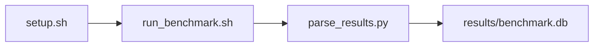

# NUMA Cache Latency Sweep Benchmark

[](LICENSE)
[](.github/workflows/ci.yml)

Target: Ubuntu 24.04 · AMD · see Hardware Requirements. This is a host benchmark, not a laptop `pip install` project.

## Quick Start

```bash
git clone https://github.com/garys-gpu-benchmarks/110-sys-bench-amd-numa-cache-performance-ubu2404.git
cd 110-sys-bench-amd-numa-cache-performance-ubu2404
sudo bash setup.sh --assume-yes
bash run_benchmark.sh --profile smoke --validate
```
Results are written to `results/benchmark.db` and `results/summary.json`.

This workload is executed on the validation host after the repository is copied there. `setup.sh` and `run_benchmark.sh` do not open an outbound SSH session.

Prerequisites: Ubuntu 24.04; AMD; Python 3.12.3; root or sudo for `setup.sh`. Framework: Bash, SQLite, Python, PyYAML, C/C++, CMake, GCC, OpenMP, NUMA, numactl. This is a host benchmark, not a laptop `pip install` project.



## 1. Overview

Builds bin/numa_sweep and walks yaml source versus target NUMA nodes for each working_set_size. source_numa_node, target_numa_node, num_threads, page_size, stride, access_pattern, cache_level, and num_iterations come from yaml. Optional perf stat -e cache-misses may be attached. The harness raw file keeps local/remote latency columns; overlay also has ratio, bandwidth, and miss-rate fields Sweep dimensions: source_numa_node, target_numa_node, num_threads, thread_affinity, page_size, working_set_size, cache_level, access_pattern.

## 2. What It Validates

- Validates local and remote NUMA latency rows from numa_sweep. Do not pass a single --working-set-size or the sweep collapses
- #1: Largest cache-tier pointer-chase latency, ns (cache_latency_nsec); is present and physically sensible.
- #2: Local DRAM pointer-chase latency, ns (local_numa_node_latency_nsec); is present and physically sensible.
- #3: Pointer-chase payload rate, GB/s (local_dram_pointer_chase_bandwidth_gb_s); is present and physically sensible.
- #4: DRAM-tier cache misses/s (cache_miss_counters_misses_sec) is present and physically sensible.

## 3. Metrics Captured

- **#1: Largest cache-tier pointer-chase latency, ns** — stored as `cache_latency_nsec`.
- **#2: Local DRAM pointer-chase latency, ns** — stored as `local_numa_node_latency_nsec`.
- **#3: Pointer-chase payload rate, GB/s** — stored as `local_dram_pointer_chase_bandwidth_gb_s`.
- **#4: DRAM-tier cache misses/s** — stored as `cache_miss_counters_misses_sec`.

## 4. Hardware Requirements

### Supported environment

- OS: Ubuntu 24.04
- GPU vendor: AMD
- Framework family: Bash, SQLite, Python, PyYAML, C/C++, CMake, GCC, OpenMP, NUMA, numactl
- Python: Python 3.12.3

### Reference validation environment

The tables below describe the machine used to generate the reference results. They are not a requirement that every user buy that exact cloud instance.

### System

Ubuntu 24.04 / AMD / Bash, SQLite, Python, PyYAML, C/C++, CMake, GCC, OpenMP, NUMA, numactl

### GPU

Ubuntu 24.04 / AMD / Bash, SQLite, Python, PyYAML, C/C++, CMake, GCC, OpenMP, NUMA, numactl

## 5. Software Requirements

| Component | Version |
|---|---|
| OS | Ubuntu 24.04 |
| Kernel | kernel 6.8.0 |
| Python | Python 3.12.3 |
| ROCm | N/A - ROCm not used |
| rocBLAS | N/A - rocBLAS not used |

Builds bin/numa_sweep and walks yaml source versus target NUMA nodes for each working_set_size. source_numa_node, target_numa_node, num_threads, page_size, stride, access_pattern, cache_level, and num_iterations come from yaml. Optional perf stat -e cache-misses may be attached.

## 6. Installation

```bash
Build and run bin/numa_sweep via scripts/collect_numa_cache.py, optionally wrapped with perf stat, binding execution to a NUMA node via numactl
```

## 7. Running the Benchmark

```bash
Build and run bin/numa_sweep via scripts/collect_numa_cache.py, optionally wrapped with perf stat, binding execution to a NUMA node via numactl
```

**Validating results separately:**

```bash
export BENCHMARK_PYTHON=/usr/bin/python3.13  # optional
python3 -m venv .venv
source ".venv/bin/activate"
".venv/bin/python" scripts/validate_results.py
```

## 8. Output

### `results/benchmark.db` (SQLite)

overlay.csv from collect_numa_cache.py, then a harness raw CSV of the summary columns. Per-size rows stay in per_size.csv

source_numa_node,target_numa_node,working_set_size,cache_level,access_pattern,stride,num_threads,page_size,local_numa_node_latency_nsec,remote_numa_node_latency_nsec,cross_socket_numa_penalty_ratio,local_dram_pointer_chase_bandwidth_gb_s,cache_miss_counters_misses_sec,cache_latency_nsec
0,0,268435456,DRAM,random,64,1,4KB,80,,,1.2,1000,12

```bash
Build and run bin/numa_sweep via scripts/collect_numa_cache.py, optionally wrapped with perf stat, binding execution to a NUMA node via numactl
```

### `results/summary.json`

Consolidated metrics from the most recent run — suitable for CI artifact upload or dashboard ingestion.

### `results/raw/<timestamp>.txt`

overlay.csv from collect_numa_cache.py, then a harness raw CSV of the summary columns. Per-size rows stay in per_size.csv

source_numa_node,target_numa_node,working_set_size,cache_level,access_pattern,stride,num_threads,page_size,local_numa_node_latency_nsec,remote_numa_node_latency_nsec,cross_socket_numa_penalty_ratio,local_dram_pointer_chase_bandwidth_gb_s,cache_miss_counters_misses_sec,cache_latency_nsec
0,0,268435456,DRAM,random,64,1,4KB,80,,,1.2,1000,12

## 9. Baselines / Thresholds

Expected ranges and gates live in `config/benchmark_config.yaml` under `baselines:` or `thresholds:`. To update them, edit that file — never edit validation code directly.

## 10. Troubleshooting

**`setup.sh` missing collector**
Create cannot finish without `scripts/collect_workload.py`.

**`self_check` overlay rewritten**
Do not overwrite files listed in `results/overlay_lock.json`.

**Remote SSH drop during setup**
Reconnect and resume `bash setup.sh --assume-yes`. Do not wipe `.venv` or `.cache`.

## 11. NVIDIA H100 Coding Differences

Primary target is AMD ROCm. NVIDIA notes in this section are reference only and are not the execution path.

## Repository layout

```text
.
├── setup.sh
├── run_benchmark.sh
├── benchmark_specification.json
├── config/
├── scripts/
├── src/
├── tests/
├── docs/
├── results/
└── LICENSE
```
